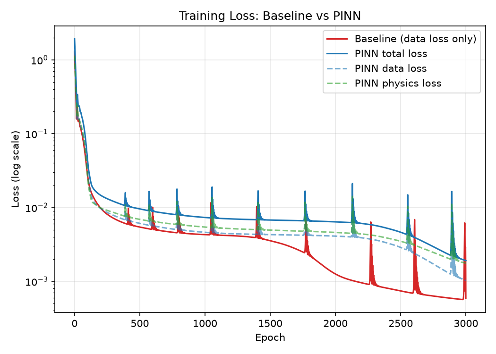

# GCA-based TFT Id-Vg PINN

[← Back to Physics-AI-Lab](../../README.md)

Applying **Physics-Informed Machine Learning** to TFT device characteristics, as the first hands-on project in [Physics-AI-Lab](../../README.md).

This project bridges two things I've spent my career on: physical system modeling and production-grade algorithm deployment — now applied to the kind of problems TCAD / Physics AI research tackles (accelerating device simulation with AI while preserving physical validity).

---

## Why this project

Classical device simulation (TCAD, SPICE-level compact models) is physically accurate but computationally expensive, especially when scanning wide parameter spaces for process/design optimization. Pure data-driven ML models are fast but can violate physical laws outside their training distribution.

**Physics-Informed Neural Networks (PINNs)** address this by embedding the governing physical equations directly into the training loss, so the model is constrained to stay physically consistent even in sparse-data regions.

This project starts with a well-understood, analytically tractable case — **TFT (Thin-Film Transistor) Id-Vg characteristics under the Gradual Channel Approximation (GCA)** — as a controlled environment to validate the PINN approach before extending to more complex device physics.

---

## Project 1: GCA-based TFT Id-Vg PINN

### Physics background

TFT drain current follows GCA, split into two operating regions:

**Linear region** (Vds < Vgs − Vth):

```
Id = μ · Cox · (W/L) · [(Vgs − Vth)·Vds − Vds²/2]
```

**Saturation region** (Vds ≥ Vgs − Vth):

```
Id = 0.5 · μ · Cox · (W/L) · (Vgs − Vth)² · (1 + λ·Vds)
```

Real TFTs deviate from this ideal model due to subthreshold behavior, mobility degradation, and interface trap effects — which is exactly where a data-informed correction on top of the physical baseline becomes useful, and where this project is headed next (see Roadmap).

### Approach

1. Generate synthetic Id-Vg data from the analytical GCA model (with and without measurement noise) as a controlled ground truth
2. Train a PINN where the loss combines:
   - **Data loss**: MSE against (noisy) synthetic measurements
   - **Physics loss**: residual of the GCA equation evaluated at collocation points
3. Compare against a pure data-driven baseline (same architecture, no physics loss) to quantify what the physics constraint actually buys — particularly in low-data and noisy regimes

**Experimental setup**: to simulate a realistic scenario with limited experimental data, only 150 out of 5000 generated points (3%) were used as labeled data. The remaining 4850 points were used as unlabeled collocation points, where only the PINN — not the baseline — receives supervision via the physics loss.

### Results

| Model | MSE (all) | MSE (unlabeled region) |
|---|---|---|
| Baseline (data-only) | 0.00206 | 0.00209 |
| PINN (data + physics) | 0.00175 | 0.00178 |
| **Improvement** | | **14.9%** |

*(MSE computed in scaled current units; see `src/train.py` for details)*




At Vds=5V, the PINN tracks the ground truth more closely than the baseline in the higher-Vgs region, where labeled data is sparser — the physics constraint helps the model generalize where data alone is insufficient.

### Known limitation / discussion point

The GCA model itself has a discontinuity at the linear–saturation boundary (Vds = Vgs − Vth), visible as a small spike in the ground truth curve at Vds=15V:


This happens because the channel-length-modulation term `(1+λVds)` is applied only in the saturation branch, so the two piecewise formulas don't match exactly at the boundary — the same artifact present in SPICE Level-1 MOSFET models. Interestingly, the PINN's prediction is smoother through this region than the baseline's, likely because the physics loss is computed densely across the full domain rather than being purely fit to nearby labeled points. A cleaner fix (adding a continuity-correction term to the saturation branch) is left as a next step rather than patched here, since the discontinuity itself is a useful illustration of a real compact-modeling issue.

### Status

| Step | Status |
|---|---|
| GCA synthetic data generator | ✅ Done |
| PINN model implementation (PyTorch) | ✅ Done |
| Data-driven baseline for comparison | ✅ Done |
| Result visualization | ✅ Done |
| Continuity-correction fix for GCA boundary discontinuity | ⬜ Planned |
| Neural Operator extension (structure generalization) | ⬜ Planned |

---

## Repo structure

```
Physics-AI-Lab/
├── projects/gca-pinn/
│   ├── src/            # generate_data.py, physics.py, model.py, train.py, evaluate.py
│   ├── data/            # Generated dataset & device parameter config
│   ├── models/          # Saved checkpoints, loss history, results.json
│   ├── assets/          # Result plots
│   └── README.md        # This file
└── README.md            # Physics-AI-Lab main README
```

---

## Roadmap

- [x] GCA-based Id-Vg synthetic dataset
- [x] PINN implementation & validation
- [x] Data-driven baseline comparison
- [ ] Continuity-correction fix for GCA boundary discontinuity
- [ ] Neural Operator extension
- [ ] TCAD surrogate model experiment (Sentaurus-generated data)

---

## Related

Part of [Physics-AI-Lab](../../README.md) — see the main README for background and the broader research roadmap.
