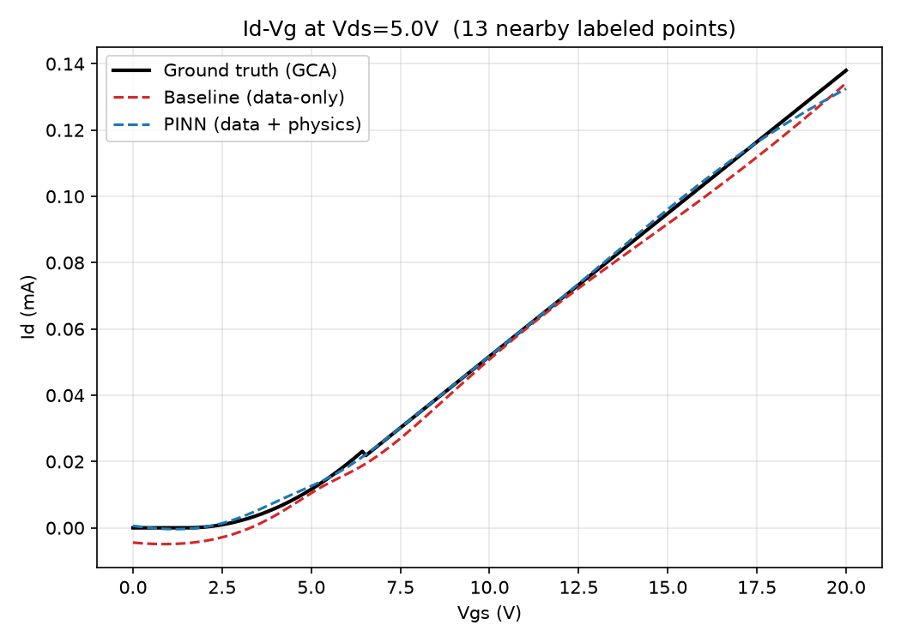
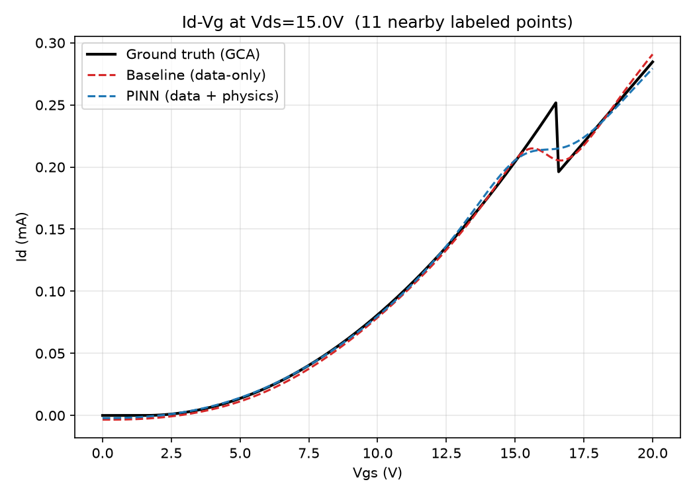

# GCA-based TFT Id-Vg PINN

[← Back to Physics-AI-Lab](../../README.md)

Applying **Physics-Informed Machine Learning** to TFT device characteristics, as the first hands-on project in [Physics-AI-Lab](../../README.md).

This project bridges two things I've spent my career on: physical system modeling and production-grade algorithm deployment — now applied to the kind of problems TCAD / Physics AI research tackles (accelerating device simulation with AI while preserving physical validity).

---

## Why this project

Classical device simulation (TCAD, SPICE-level compact models) is physically accurate but computationally expensive, especially when scanning wide parameter spaces for process/design optimization. Pure data-driven ML models are fast but can violate physical laws outside their training distribution.

**Physics-Informed Neural Networks (PINNs)** address this by embedding the governing physical equations directly into the training loss, so the model is constrained to stay physically consistent even in sparse-data regions.

This project starts with a well-understood, analytically tractable case — **TFT (Thin-Film Transistor) Id-Vg characteristics under the Gradual Channel Approximation (GCA)** — as a controlled environment to validate the PINN approach before extending to more complex device physics.

---

## Project 1: GCA-based TFT Id-Vg PINN

### Physics background

TFT drain current follows GCA, split into two operating regions:

**Linear region** (Vds < Vgs − Vth):

```
Id = μ · Cox · (W/L) · [(Vgs − Vth)·Vds − Vds²/2]
```

**Saturation region** (Vds ≥ Vgs − Vth):

```
Id = 0.5 · μ · Cox · (W/L) · (Vgs − Vth)² · [1 + λ·(Vds − (Vgs − Vth))]
```

*(Note: the channel-length-modulation term is applied to the excess `Vds − Vov` beyond the saturation point, not to `Vds` directly — see [Discontinuity fix](#discontinuity-fix-in-the-gca-model) below for why.)*

Real TFTs deviate from this ideal model due to subthreshold behavior, mobility degradation, and interface trap effects — which is exactly where a data-informed correction on top of the physical baseline becomes useful, and where this project is headed next (see Roadmap).

### Approach

1. Generate synthetic Id-Vg data from the analytical GCA model (with and without measurement noise) as a controlled ground truth
2. Train a PINN where the loss combines:
   - **Data loss**: MSE against (noisy) synthetic measurements
   - **Physics loss**: residual of the GCA equation evaluated at collocation points
3. Compare against a pure data-driven baseline (same architecture, no physics loss) to quantify what the physics constraint actually buys — particularly in low-data and noisy regimes

**Experimental setup**: to simulate a realistic scenario with limited experimental data, only 150 out of 5000 generated points (3%) were used as labeled data. The remaining 4850 points were used as unlabeled collocation points, where only the PINN — not the baseline — receives supervision via the physics loss.

### Results

| Model | MSE (all) | MSE (unlabeled region) |
|---|---|---|
| Baseline (data-only) | 0.0000889 | 0.0000896 |
| PINN (data + physics) | 0.0000847 | 0.0000849 |
| **Improvement** | | **5.2%** |

*(MSE computed in scaled current units; see `src/train.py` for details. Numbers reflect the corrected, continuous GCA model — see below.)*




At Vds=5V, the PINN tracks the ground truth more closely than the baseline in the higher-Vgs region, where labeled data is sparser — the physics constraint helps the model generalize where data alone is insufficient.

### Discontinuity fix in the GCA model

An earlier version of this model had a discontinuity at the linear–saturation boundary (Vds = Vgs − Vth): the channel-length-modulation term `(1+λVds)` was applied only in the saturation branch, so the two piecewise formulas didn't match exactly at the boundary — the same artifact present in SPICE Level-1 MOSFET models.

**Fix**: apply the modulation term to `(Vds − Vov)` instead of `Vds` directly, so the correction is exactly zero at the boundary and the saturation formula reduces to the linear formula's boundary value automatically (the same approach used in SPICE Level-1). The result is now perfectly continuous:



**An unexpected result of the fix**: the PINN's improvement over baseline dropped from 14.9% to 5.2% after removing the discontinuity. This makes sense — the physics loss provides the most value where the target function is hardest for a plain data-driven model to fit (like a sharp discontinuity from limited data). Once the ground truth became smooth, the baseline model's inductive bias (smooth MLP) was already a reasonable match for it, narrowing the gap. This is a useful, honest data point: **PINNs help most when the underlying physics is genuinely hard to infer from data alone, not just whenever physics is available.**

### Status

| Step | Status |
|---|---|
| GCA synthetic data generator | ✅ Done |
| PINN model implementation (PyTorch) | ✅ Done |
| Data-driven baseline for comparison | ✅ Done |
| Result visualization | ✅ Done |
| Continuity-correction fix for GCA boundary discontinuity | ✅ Done |
| Neural Operator extension (structure generalization) | ✅ Done → [`02_neural-operator`](../02_neural-operator) |

---

## Repo structure

```
Physics-AI-Lab/
├── projects/01_gca-pinn/
│   ├── src/            # generate_data.py, physics.py, model.py, train.py, evaluate.py
│   ├── data/            # Generated dataset & device parameter config
│   ├── models/          # Saved checkpoints, loss history, results.json
│   ├── assets/          # Result plots
│   └── README.md        # This file
└── README.md            # Physics-AI-Lab main README
```

---

## Roadmap

- [x] GCA-based Id-Vg synthetic dataset
- [x] PINN implementation & validation
- [x] Data-driven baseline comparison
- [x] Continuity-correction fix for GCA boundary discontinuity
- [ ] Neural Operator extension
- [ ] TCAD surrogate model experiment (own FEM-based 1D device simulator, since Sentaurus is not currently accessible)

---

## Related

Part of [Physics-AI-Lab](../../README.md) — see the main README for background and the broader research roadmap.