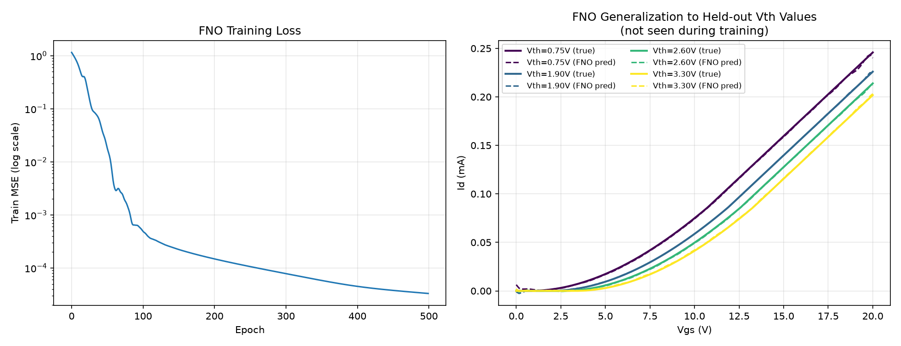

# Neural Operator: Vth Generalization with PhysicsNeMo FNO

[← Back to Physics-AI-Lab](../../README.md)

이 프로젝트는 [`gca-pinn`](../01_gca-pinn) 프로젝트의 자연스러운 다음 단계입니다. GCA-PINN은 **하나의 고정된 소자**(고정 Vth, mobility 등)에 대해 (Vgs, Vds) → Id를 점 단위로 예측하는 PINN이었습니다. 여기서는 **소자 파라미터(Vth)가 달라져도 재학습 없이 대응하는 Operator**를 NVIDIA PhysicsNeMo의 공식 FNO(Fourier Neural Operator) 구현으로 학습합니다.

## 배경 — 왜 Neural Operator인가

[SK하이닉스 TCAD Intelligence 팀의 사례](../../paper-reviews/00_SK-hynix-NVIDIA-AI-Physics-for-TCAD.md)와 [Fe-VNAND PINO 논문](<../../paper-reviews/04_Physics-informed AI Accelerated Retention Analysis of Ferroelectric Vertical NAND.md>)에서 공통적으로 확인한 점: 실무에서 필요한 건 "소자 하나에 대한 정확한 시뮬레이션"이 아니라, **넓은 파라미터 공간(다양한 소자 설계 후보)을 재학습 없이 빠르게 스캔하는 것**입니다. PINN은 전자를, Neural Operator(FNO, DeepONet 등)는 후자를 겨냥합니다.

## 실험 설계

- **입력**: Vth 값을 Vgs grid 전체에 constant field로 broadcast한 1채널 함수
- **출력**: 해당 Vth에서의 전체 Id-Vg 곡선 (Vds=10V 고정)
- **학습**: Vth ∈ [0.5V, 3.5V] 구간에서 15개 값 샘플링
- **평가**: 학습에 전혀 없던 4개 Vth 값(0.75V, 1.9V, 2.6V, 3.3V)에 대해 재학습 없이 예측 → **operator generalization**을 직접 검증
- **모델**: NVIDIA PhysicsNeMo `physicsnemo.models.fno.FNO` (1D, 4 FNO layers, 32 latent channels, 16 Fourier modes)

## 결과

- Held-out Vth 값들에 대한 일반화 MSE: **0.000052** (scaled units)
- 아래 그래프에서 실제 곡선(실선)과 FNO 예측(점선)이 학습에 없던 Vth 값들에서도 시각적으로 거의 완전히 겹침:

## PhysicsNeMo 사용 경험

- `pip install nvidia-physicsnemo`로 설치, GPU 없이도 CPU에서 정상 동작 확인
- `physicsnemo.models.fno.FNO`는 PyTorch `nn.Module`과 동일한 인터페이스라 기존 학습 루프에 바로 통합 가능
- 이 프레임워크가 지원하는 다른 모델(MeshGraphNet, GraphCast, DoMINO, Transolver 등)도 확인 — 다음 단계(공정 시뮬레이션, mesh 기반 문제)로 확장할 때 활용 가능

## Status

| Step | Status |
|---|---|
| Vth 파라미터 공간 데이터셋 생성 | ✅ Done |
| PhysicsNeMo FNO로 operator 학습 | ✅ Done |
| Held-out Vth 일반화 검증 | ✅ Done |
| 2D 확장 (Vgs, Vds 전체 곡면에 대한 operator) | ⬜ Planned |
| 실제 GCA-PINN과의 정량 비교 (operator vs point-wise PINN) | ⬜ Planned |
