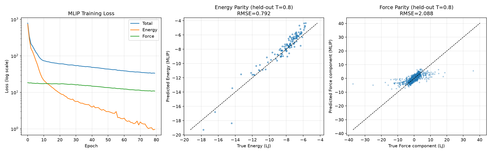

# Toy MLIP: Neural Network Potential for Lennard-Jones Clusters

Physics-AI-Lab의 네 번째 프로젝트. 지금까지(GCA-PINN, Neural Operator, TCAD Surrogate)는 전부 소자(device) 레벨이었는데, 이번엔 **원자/소재 레벨(Material Simulation)**로 내려가 Machine Learning Interatomic Potential(MLIP)을 직접 구현했습니다. 소자 레벨 시뮬레이션만으로는 다루지 못했던 원자 단위 물성 모델링 역량을 채우는 프로젝트입니다.

## Motivation

실제 MLIP은 DFT 같은 비싼 ab-initio 계산 결과를 신경망으로 근사해 MD 시뮬레이션을 가속화합니다. 여기서는 DFT 대신 **해석적으로 정확히 알려진 Lennard-Jones 포텐셜**을 "정답"으로 사용합니다 — GCA-PINN에서 GCA 방정식이 정답 역할을 했던 것과 정확히 같은 설계 패턴입니다.

## Pipeline

### 1. LJ MD 시뮬레이터 (`lj_md.py`)
- Velocity Verlet 적분 + velocity-rescaling thermostat으로 20-atom LJ 클러스터의 MD 궤적 생성
- 4개 온도(T=0.2~0.8, reduced units)에서 각각 궤적을 뽑아 다양한 원자 배치 확보
- T=0.2/0.4/0.6은 학습용, **T=0.8(학습에 없던 온도)은 검증용** — Neural Operator, TCAD Surrogate 프로젝트와 동일한 "held-out parameter" 일반화 검증 패턴

### 2. Symmetry Function Descriptor (`descriptors.py`)
- Behler-Parrinello(2007) 스타일 radial symmetry function을 간략화해 구현 (각도 항 G4/G5는 제외, radial G2류만 사용 — 논문 원본과의 차이를 명시)
- 원자 순서·회전에 불변한 고정 길이 벡터로 원자 국소 환경을 표현
- **미분가능성 확보**: `torch.where`의 backward pass에서 선택되지 않은 branch도 미분되어 NaN gradient가 발생하는 PyTorch의 잘 알려진 함정을 피하기 위해, self-distance를 `inf`로 마스킹하는 대신 유한한 값을 유지하며 명시적 마스크로 처리

### 3. 신경망 포텐셜 (`mlip_model.py`)
- 모든 원자가 동일한 신경망을 공유(shared weights) — 순서 불변성과 임의 원자 수로의 일반화를 동시에 보장하는 핵심 설계
- 전체 에너지는 원자별 에너지의 합, **힘은 에너지의 위치 미분(autograd)으로 자동 계산** (에너지 보존을 구조적으로 만족)

### 4. 학습 (`train_mlip.py`)
- **Energy loss + Force loss dual loss** — GCA-PINN의 data loss + physics loss와 같은 설계 철학 (에너지만 맞추면 힘의 방향까지 정확하다는 보장이 없어, 미분 구조까지 명시적으로 학습하도록 강제)

## Results

- **에너지 예측 (held-out T=0.8)**: RMSE 0.79 (원자당 MAE 0.03) — 학습에 없던 온도에서도 에너지는 상당히 정확하게 일반화됨
- **힘 예측**: RMSE 2.09, 실제 힘의 표준편차(2.69) 대비 상대오차 약 78%

### 정직하게 기록하는 핵심 발견: Force-matching이 Energy-matching보다 훨씬 어려움
처음엔 force loss 가중치가 너무 작아(0.1) 학습 내내 force loss가 전혀 줄지 않는 문제가 있었음. 가중치를 3.0으로 올리자 force RMSE가 명확히 개선됐지만(상대오차 103%→78%), 여전히 에너지만큼 정확하지 않음. 이는 개인적인 구현 실수라기보다 **실제 MLIP 연구 문헌에서도 잘 알려진 근본적 어려움**이다 — 에너지는 스칼라 하나만 맞추면 되지만, 힘은 국소적인 에너지 곡면의 기울기(미분)까지 정확해야 하므로 훨씬 엄격한 제약이다. 이 프로젝트에서 쓴 descriptor(radial 항만, 6개 기준점, 작은 hidden layer)의 표현력 한계도 기여했을 것으로 추정.

## Status

| Step | Status |
|---|---|
| LJ MD 시뮬레이터 (velocity Verlet + thermostat) | ✅ Done |
| 미분가능 symmetry function descriptor | ✅ Done |
| Shared-weight 신경망 포텐셜 + autograd force | ✅ Done |
| Energy+Force dual loss 학습 | ✅ Done |
| Held-out 온도(T=0.8) 일반화 검증 | ✅ Done |
| Force-matching 정확도 개선 (각도 항 추가, descriptor 확장) | ⬜ Planned |
| 학습된 포텐셜로 직접 MD 실행 + 에너지 보존 검증 | ⬜ Planned |

## Files
- `src/lj_md.py` — LJ 포텐셜 + MD 시뮬레이터, 데이터 생성
- `src/descriptors.py` — 미분가능 radial symmetry function
- `src/mlip_model.py` — shared-weight 신경망 포텐셜
- `src/train_mlip.py` — energy+force dual loss 학습
- `src/evaluate.py` — 결과 시각화 (parity plot)
