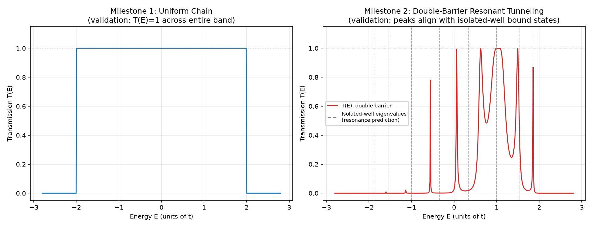
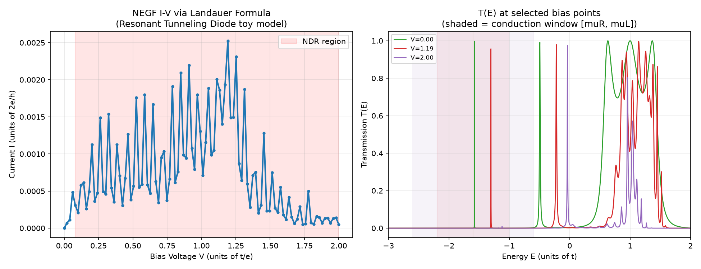

# NEGF Quantum Transport: 1D Tight-Binding Toy Model

Physics-AI-Lab의 다섯 번째 프로젝트. 나노스케일 소자에서 양자역학적 효과가 지배적인 영역을 다루는 **NEGF(Non-Equilibrium Green's Function)**를 1D tight-binding 체인 + 반무한 리드라는 표준 교과서 설정으로 직접 구현했습니다.

## 물리적 배경

NEGF의 핵심 아이디어는, 디바이스에 연결된 무한히 긴 리드를 명시적으로 다루는 대신 **self-energy**라는 유효 항으로 "요약"해 유한 크기 행렬 문제로 축소하는 것입니다. 이 프레임워크는 나노와이어 FET, 터널링 다이오드 등 양자역학적 효과가 지배적인 나노스케일 소자 시뮬레이션의 표준 도구입니다.

- **디바이스**: N개 사이트의 1D tight-binding 체인 (on-site energy, hopping t)
- **리드**: 디바이스와 결합된 반무한(semi-infinite) 1D 체인, 표면 Green's function의 닫힌 형태(analytic closed form) 해를 이용해 self-energy를 정확히 계산 (반복 계산인 Sancho-Rubio 알고리즘 없이도 exact)
- **투과율**: T(E) = Tr[Γ_L G^R Γ_R G^A] (Landauer-Büttiker 공식의 핵심)

## Milestone 1: 균일한 체인 (검증 기준선)

리드와 완전히 동일한 균일 체인을 디바이스로 놓으면, 산란이 전혀 없는 탄도수송(ballistic transport)이 되어 **이론적으로 T(E)=1이 밴드 전체(-2t~2t)에서 정확히 성립**해야 합니다.

**결과**: 밴드 내부 T(E) 평균 = 1.000000, 이론값 대비 최대 오차 1×10⁻⁶ — NEGF 구현이 수치적으로 정확함을 보여주는 강력한 검증.

## Milestone 2: Double-Barrier 공명터널링

체인 중간에 포텐셜 장벽 2개(높이 Vb=2.0t)를 세워 그 사이에 양자 우물을 만들었습니다. 이 구조는 실제 RTD(Resonant Tunneling Diode) 소자의 최소 모델입니다.

**검증 방법**: 우물 부분만 떼어내 고립계(hard-wall boundary)로 대각화해 근사 준속박상태 에너지를 구하고, 이를 실제 열린 시스템(리드에 결합된)의 T(E) 공명 피크 위치와 비교.



**결과**: 여러 공명 피크가 예측된 준속박상태 에너지 근처에서 명확하게 나타남 (정확히 일치하지는 않는데, 이는 유한한 장벽 높이로 인해 준속박상태가 리드와 결합하며 에너지가 약간 이동하고 폭이 생기는 물리적으로 당연한 현상 — 고립계 근사와 실제 열린 시스템의 차이).

## Milestone 3: I-V via Landauer Formula (NDR)

Landauer 공식으로 실제 전류-전압 특성을 계산했습니다:

```
I(V) = (2e/h) * Integral[ T(E,V) * (f(E-muL) - f(E-muR)) ] dE
muL = EF + V/2,  muR = EF - V/2
```

**핵심 이슈와 해결**: T(E)를 고정한 채 화학전위 창만 넓히면 적분 구간이 항상 커지기만 해서 전류가 단조증가만 하고, RTD의 핵심 특징인 **NDR(음의 미분저항)**이 나오지 않는다. 실제로는 self-consistent Poisson-NEGF가 바이어스에 따른 전위 재분배를 계산하지만, 여기서는 교과서 수준의 단순화로 **디바이스에 선형 포텐셜 램프**를 걸어 바이어스 효과를 흉내냈다.

**추가로 발견한 버그**: 처음엔 우물을 디바이스 중앙에 대칭으로 배치했는데, 이러면 램프의 "0점"과 우물 위치가 정확히 겹쳐서 **바이어스가 걸려도 우물의 에너지 준위가 전혀 이동하지 않는** 현상이 발생했다 (대칭성에 의해 효과가 정확히 상쇄됨). 디바이스를 비대칭으로 만들어(오른쪽에 버퍼 추가) 해결.



**결과**: 전압에 따라 공명 준위가 이동하는 것을 오른쪽 패널에서 확인할 수 있고(V=0, 1.19, 2.00에서 피크 위치가 다름), I-V 곡선 전체 포락선은 **상승 → 피크(V≈1.2) → NDR**이라는 RTD의 교과서적 형태를 보인다.

**한계 (정직하게 기록)**: 공명 피크의 선폭이 매우 좁아(리드 결합이 약함) 전압 grid 해상도로 완전히 매끄럽게 잡기 어려워, 전체 포락선 위에 미세한 톱니 노이즈가 남아있다. 실제 물리(넓은 트렌드)는 유효하지만, 정밀한 정량 곡선을 원하면 훨씬 촘촘한 (E, V) 격자나 적응형(adaptive) 적분이 필요함.


## Status

| Step | Status |
|---|---|
| 반무한 리드 self-energy (analytic closed form) | ✅ Done |
| 균일 체인 T(E)=1 검증 (오차 1e-6) | ✅ Done |
| Double-barrier 공명터널링 구현 및 검증 | ✅ Done |
| Landauer 공식 I-V 계산 + NDR 재현 | ✅ Done |
| I-V 곡선 미세 노이즈 개선 (격자 해상도/적응형 적분) | ⬜ Planned |
| ML 서로게이트로 T(E) 예측 가속 (AD-NEGF, DeePTB-NEGF 논문 참고) | ⬜ Planned |

## Files
- `src/negf_core.py` — NEGF 핵심 (표면 Green's function, self-energy, 투과율 계산)
- `src/sweep_transmission.py` — Milestone 1&2 스펙트럼 계산, 검증, 시각화
- `src/landauer_iv.py` — Milestone 3: Landauer 공식 I-V 계산, 바이어스 램프, NDR 검증

## 관련 논문 리뷰
- [Fe-VNAND PINO 논문](<../../paper-reviews/04_Physics-informed AI Accelerated Retention Analysis of Ferroelectric Vertical NAND.md>)에서 다룬 Physics-Informed AI 가속 개념을 NEGF에도 적용 가능 — 다음 확장 방향으로 AD-NEGF(arXiv:2202.05098), DeePTB-NEGF 논문 리뷰 예정
