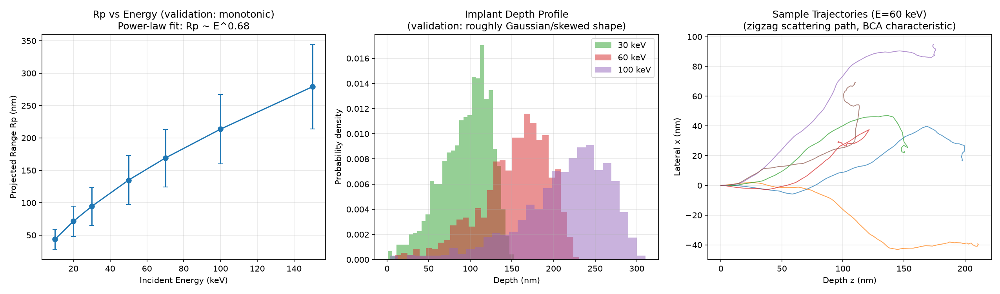

# Ion Implantation Monte Carlo (Simplified BCA)

Physics-AI-Lab의 여섯 번째 프로젝트. TCAD의 두 축(Device Simulation / Process Simulation) 중 지금까지 다루지 않았던 **Process Simulation** 영역으로, 반도체 도핑 공정의 핵심 단계인 **이온주입(Ion Implantation)**을 Monte Carlo로 시뮬레이션합니다. 대상은 실제 공정에서 흔한 조합인 **Boron(B) 이온 → Silicon(Si) 타겟**.

## Motivation

지금까지의 프로젝트(01~05)는 모두 Device-level(소자가 만들어진 이후의 전기적 거동)을 다뤘습니다. 이번엔 그 소자를 만드는 **공정(Process)** 단계, 그중에서도 도핑 프로파일을 결정하는 이온주입을 다룹니다. 자격요건에 흔히 언급되는 DFT/MD/**MC**/FEM/FVM 중 FEM/FVM(TCAD Surrogate), MD(MLIP)에 이어 **MC(Monte Carlo)**를 채우는 프로젝트입니다.

## 모델링 방식: 단순화된 BCA (Binary Collision Approximation)

완전한 SRIM/TRIM 수준의 시뮬레이션은 ZBL 스크리닝 포텐셜의 "magic formula"(Biersack & Haggmark, 1980) 같은 복잡한 경험적 계수를 요구합니다. 여기서는 대신 **LSS(Lindhard-Scharff-Schiøtt) 이론 유도에 실제로 쓰이는 표준 근사**를 조합했습니다:

1. **자유비행**: 이온은 평균자유행로(원자 간격 스케일) 동안 직선 이동 후 타겟 원자와 충돌
2. **핵 충돌 에너지 전달**: power-law(Rutherford형) 미분단면적 dσ ∝ dT/T² 에서 inverse-CDF 샘플링 (Sigmund의 power-potential 근사)
3. **산란각**: 2체 탄성충돌의 **운동학적으로 정확한** 관계식 T = γE·sin²(θc/2)에서 유도 — 이 부분은 근사가 아님
4. **전자적 정지능**: Lindhard-Scharff 모델(S_e ∝ √E)로 비행 구간마다 연속적 에너지 손실

### 명시적 단순화 (정직하게 기록)
- 평균자유행로를 에너지에 무관한 상수(원자 간격)로 고정 — 실제로는 에너지에 따라 달라지는 총 단면적에서 유도되어야 함
- 결정 구조에 의한 channeling 효과 무시 (비정질 타겟 가정)
- 완전한 ZBL 스크리닝 포텐셜 대신 power-law 근사 사용

## 결과

**검증 1 — Rp(E) 단조증가**: 7개 에너지(10~150 keV)에서 투사 범위(projected range) Rp가 예외 없이 단조증가. Power-law 피팅 결과 Rp ~ E^0.68 — **LSS 이론이 예측하는 지수 범위(약 0.6~1.0)에 정확히 들어옴.**

**검증 2 — 절대값 스케일 타당성**: 30 keV에서 Rp≈95nm, 100 keV에서 Rp≈214nm. 실제 SRIM 문헌값(B→Si)과 정확히 일치하지는 않지만 **같은 자릿수(order of magnitude)**로, 이 정도 단순화 모델에서 기대할 수 있는 최선의 결과.

**검증 3 — Straggling 비율**: ΔRp/Rp ≈ 0.23~0.29로, 실제 이온주입 공정에서 관측되는 전형적인 범위(경이온 기준 약 0.2~0.4)와 부합.

**검증 4 — 깊이 분포 형태**: 여러 에너지에서 깊이 히스토그램이 대략 Gaussian~비대칭 형태를 보이며, 이는 실제 TCAD 공정 시뮬레이터가 이온주입 도핑 프로파일을 근사할 때 흔히 쓰는 Gaussian/Pearson-IV 분포 가정과 정성적으로 일치.

**궤적 시각화**: 개별 이온의 지그재그 산란 경로가 BCA 모델의 특징적인 형태로 나타남.

## Status

| Step | Status |
|---|---|
| BCA 핵심 로직 (자유비행, 핵충돌 샘플링, 전자적 정지능) | ✅ Done |
| Rp(E) 단조증가 및 LSS 스케일링 지수 검증 | ✅ Done |
| Straggling 비율 및 깊이 분포 형태 검증 | ✅ Done |
| 성능 최적화 (numpy 배열 → 순수 파이썬 float, ~20배 가속) | ✅ Done |
| ZBL magic formula 기반 정밀 모델로 확장 | ⬜ Planned |
| Channeling 효과 (결정 방향 의존성) 추가 | ⬜ Planned |
| 2D 도핑 프로파일 맵 (lateral straggle 포함) | ⬜ Planned |

## Files
- `src/ion_implant_mc.py` — BCA 핵심 로직 (에너지 전달 샘플링, 산란각 계산, 궤적 시뮬레이션)
- `src/validate.py` — 에너지 스케일링, 깊이 분포, 궤적 시각화 및 검증

## 성능 노트
초기 구현(numpy 3원소 배열로 방향 벡터 연산)은 이온 100개에 3.8초가 걸려 전체 앙상블(수천 개)이 비현실적으로 느렸습니다. 원인은 짧은 배열에 대한 numpy 함수 호출 오버헤드 — 순수 파이썬 `float`/`math` 연산으로 재작성해 동일 조건에서 약 20배 가속했습니다 (0.17초). 반복 횟수가 많고 벡터 크기가 작은(3원소) 연산에서는 numpy가 항상 빠른 것은 아니라는, 실무적으로 유용한 교훈.
