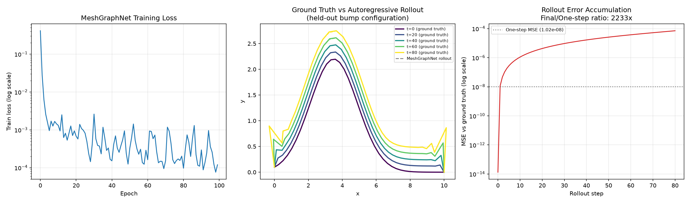

# MeshGraphNet: Curvature-Driven Front Evolution (Etch Profile Toy Model)

Physics-AI-Lab의 일곱 번째 프로젝트. [SK하이닉스 TCAD Intelligence 팀 블로그](../../paper-reviews/00_SK-hynix-NVIDIA-AI-Physics-for-TCAD.md)와 [논문 리뷰 12번(MeshGraphNets)](../../paper-reviews/12_MeshGraphNets.md)에서 다룬 GNN 기반 mesh 시뮬레이션을, 식각(etching) 경계면 형상 변화라는 단순화된 문제로 직접 구현했습니다. [프로젝트 06(이온주입 MC)](../06_mc-implant)에 이어 TCAD의 Process Simulation 영역을 계속 다룹니다.

## 설계 결정: 왜 PhysicsNeMo 공식 모듈 대신 직접 구현했는가

NVIDIA PhysicsNeMo에는 공식 `meshgraphnet` 모듈이 있지만, 내부적으로 DGL(Deep Graph Library) 의존성을 가질 가능성이 높아 이 환경에서 추가 설치 리스크가 있습니다. 대신 Pfaff et al.(2020)의 핵심 아키텍처(**Encode-Process-Decode + message passing**)를 순수 PyTorch로 직접 구현했습니다 — MLIP 프로젝트에서 Behler-Parrinello 신경망을 직접 구현한 것과 같은 접근입니다.

## 물리적 대상: 곡률 흐름(Curvature Flow) 기반 경계면 전파

경계면을 순서가 있는 점들의 열(open curve, front-tracking 방식)로 표현하고, 각 점을 국소 법선 방향으로 다음 속도로 이동시킵니다:

```
v_normal = etch_rate - alpha * kappa
```

볼록한 곳(양의 곡률)이 더 빨리 식각되어 매끄러워지는 표준 mean curvature flow와 같은 부호 관례입니다.

### 물리 검증: 반원 형상의 해석적 수축 속도와 비교

`etch_rate=0`으로 두면 순수 curvature flow가 되어, 반원의 반지름이 `dR/dt = -alpha/R`을 따라 줄어드는 해석해와 비교할 수 있습니다. 시뮬레이터의 반원 수축 결과는 해석해 대비 **최대 상대오차 2.1%**로, ground truth 생성기 자체의 물리적 타당성을 먼저 확인했습니다.

## MeshGraphNet 아키텍처 & 학습

- **그래프 구조**: 경계면 점들을 체인(chain) 그래프로 연결 (이웃 점과 양방향 edge)
- **Node feature**: 위치(x,y), 국소 곡률, 경계조건 플래그(양 끝점 고정)
- **Edge feature**: 이웃 노드 간 상대 위치(dx,dy) — 평행이동 불변성을 위한 표준 관행
- **Target**: 다음 스텝의 변위(displacement)
- **학습**: 범프 위치/높이가 다른 5개 궤적(400 스냅샷)으로 학습, **학습에 없던 범프 조합 1개**를 완전히 별도로 검증

## 결과



**One-step 예측은 사실상 완벽**하게 학습됨 (MSE ≈ 3×10⁻⁸ 수준).

**Rollout(자기회귀) 평가 — 정직하게 기록하는 핵심 발견**: 초기 프로파일만 주고 예측된 변위를 80스텝 동안 반복 적용했을 때, one-step 대비 **오차가 약 2233배 누적**됩니다. 다만 절대적인 크기로 보면 여전히 작아서, 최종 스텝에서 실제 경계면의 정점 높이(2.749)와 예측 경계면의 정점 높이(2.745)가 육안으로 거의 구분되지 않을 정도로 잘 맞습니다.

이 현상은 구현 버그가 아니라 **실제 MeshGraphNet 문헌에서도 잘 알려진 핵심 난제**입니다. 매 스텝의 작은 오차가 다음 스텝의 입력이 되어 누적되는 것이 자기회귀 롤아웃의 근본적 특성이며, [어제 리뷰한 SK하이닉스 블로그](../../paper-reviews/00_SK-hynix-NVIDIA-AI-Physics-for-TCAD.md)에서 "매 iteration마다 재메싱(re-meshing)과 material feature 업데이트가 필요했다"고 언급한 이유도 정확히 이 오차 누적 문제를 완화하기 위한 것으로 이해됩니다.

## Status

| Step | Status |
|---|---|
| 곡률 흐름 ground truth 시뮬레이터 (front-tracking) | ✅ Done |
| 반원 수축 해석해 검증 (상대오차 2.1%) | ✅ Done |
| MeshGraphNet(Encode-Process-Decode) PyTorch 직접 구현 | ✅ Done |
| One-step 예측 학습 및 held-out 검증 | ✅ Done |
| Rollout(자기회귀) 평가 및 오차 누적 현상 확인·기록 | ✅ Done |
| Re-meshing/noise injection으로 rollout 안정성 개선 (Pfaff et al. 기법) | ⬜ Planned |
| 2D mesh(체인이 아닌 삼각형 mesh)로 확장 | ⬜ Planned |

## Files
- `src/front_sim.py` — 곡률 흐름 ground truth 시뮬레이터, 반원 수축 검증
- `src/meshgraphnet_model.py` — Encode-Process-Decode MeshGraphNet 아키텍처
- `src/generate_dataset.py` — 여러 초기 형상에 대한 궤적 생성 및 그래프 데이터셋 변환
- `src/train_meshgraphnet.py` — 학습, one-step/rollout 평가
- `src/evaluate.py` — 결과 시각화
