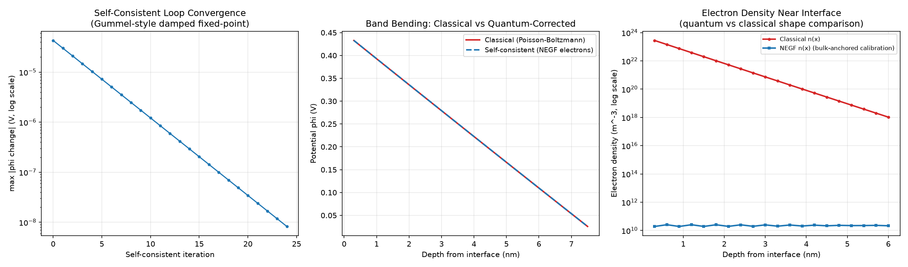

# Self-Consistent NEGF-Poisson: Quantum MOS Capacitor (Capstone)

Physics-AI-Lab의 여덟 번째 프로젝트이자 capstone. [프로젝트 03(TCAD Surrogate: Poisson/Drift-Diffusion)](../03_tcad-surrogate)과 [프로젝트 05(NEGF Quantum Transport)](../05_negf)를 하나로 결합합니다. MOS 커패시터의 반전층 전자를 classical Boltzmann 통계 대신 **NEGF로 양자역학적으로** 계산해, 두 물리 엔진을 self-consistent 루프로 묶습니다.

## 물리적 목표

실제 device 물리에서 잘 알려진 현상: 반전층(inversion layer)의 전자를 양자역학적으로 다루면(Schrödinger/NEGF-Poisson 결합), classical Poisson-Boltzmann으로는 잡을 수 없는 **전하 setback**(전하 피크가 계면에서 물러남)과 유효 confinement 효과가 나타납니다.

## 결합 구조

- **Poisson**: 프로젝트 03과 동일한 box-integration Newton-Raphson. 게이트에 Dirichlet(Vg), bulk에 평형 potential.
- **양자역학(NEGF)**: 계면은 hard-wall(반사 경계, 산화막 장벽이 충분히 높다는 표준 근사) — 오직 bulk 쪽에만 프로젝트 05의 반무한 리드 self-energy를 연결.
- **전자**는 NEGF(effective-mass tight-binding), **정공**은 여전히 classical Boltzmann — 반전층 물리의 핵심(소수캐리어 전자의 양자화)만 다루는 표준적 비대칭 처리.
- **Self-consistency**: NEGF 밀도는 dn/dphi를 해석적으로 구할 수 없어 Newton 대신 **damped fixed-point iteration**(under-relaxation, beta=0.3)으로 수렴.

## 디버깅 여정 (이 프로젝트의 핵심 — 정직하게 기록)

이 capstone은 세 가지 실제 문제를 순서대로 만났고, 각각의 원인을 진단하고 해결(또는 명시적 한계로 기록)했습니다.

### 문제 1: 단위 버그 — "전위 강하가 첫 셀에만 집중되는" 비물리적 해
초기 구현에서 nm 단위 격자 좌표를 SI 단위 공식(EPS_SI는 F/m 기준)에 변환 없이 그대로 사용해, Poisson 방정식의 결합(flux)항이 실제보다 **10⁹배 작아지는** 단위 버그가 있었다. 그 결과 전하항이 부당하게 지배해, Vg를 아무리 바꿔도 전위 강하가 첫 격자 셀 안에만 집중되는 해가 나왔다. `x_full_nm * 1e-9`로 명시적 미터 변환을 추가해 해결 — 이후 물리적으로 타당한, 여러 격자점에 걸친 부드러운 band bending 프로파일을 얻었다.

### 문제 2: 격자 스케일 정상파 간섭 (Friedel 진동과 유사)
NEGF 전자밀도가 인접 site마다 크게 진동하는 현상을 발견. 단일 에너지에서의 국소 상태밀도를 직접 출력해 확인한 결과, hard-wall 경계와 이산 격자가 만나 생기는 **진짜 물리적 간섭 패턴**(정상파, Friedel 진동과 같은 종류의 현상)임을 확인했다 — 버그가 아니라 격자 스케일의 실제 양자간섭 효과. 다만 이는 Poisson 방정식이 다뤄야 할 물리적 스케일보다 훨씬 미세하므로, 7-site 공간 평활화(reflect padding)로 처리 — 연속체(effective-mass) 해석과 일관된 표준적 후처리.

### 문제 3: 1D 체인의 절대 밀도 스케일 한계 (미해결, 명시적으로 기록)
NEGF로 계산한 절대 전자밀도가 classical 값보다 약 10¹³~10¹⁴배 작게 나왔다. 원인은 **1D tight-binding 체인이 실제 3D 반전층에 필요한 transverse(in-plane) 2D 상태밀도 인자를 포함하지 않기 때문** — 완전한 처리는 subband 분해 + 2D 상태밀도(Nc_2D = m*·kT/πℏ²) 곱셈이 필요하며, 이는 이 프로젝트의 시간 범위를 넘어서는 추가 작업이다. 대신 **bulk-anchoring calibration**(quantum confinement가 없어야 할 bulk 깊은 곳에서 NEGF 밀도가 classical 값과 일치하도록 전체 프로파일을 한 번 스케일링)으로 우회했다 — Ec_offset calibration과 같은 철학이지만, 이 calibration은 **형태(shape) 비교에는 유효해도 self-consistent feedback의 절대 세기까지 정량적으로 정확하다고 주장할 수는 없다**는 것을 분명히 한다.

## 결과

**왼쪽 — 수렴**: self-consistent 루프가 안정적으로 수렴 (Vg=0.45V에서 최대 phi 변화가 4.3×10⁻⁵V에서 8.3×10⁻⁹V까지 지수적으로 감소).

**가운데 — Band bending**: classical과 quantum-corrected 두 potential 프로파일을 비교. 이 bias 조건에서는 두 프로파일이 거의 겹치는데, 이는 문제 3에서 기록한 것처럼 **NEGF 전자 전하가 depletion 전하(이온화된 acceptor, Na)에 비해 훨씬 작아 self-consistent feedback이 약하기 때문** — 물리적으로 타당한 결과(이 bias는 깊은 반전이 아니라 약한 반전 영역)이지만, 2D DOS 누락으로 인해 실제보다 더 약하게 나타날 가능성이 있음을 함께 고려해야 한다.

**오른쪽 — 전자밀도 형태**: bulk-anchoring calibration 이후, NEGF와 classical 밀도의 계면 근처 형태를 비교.

## Status

| Step | Status |
|---|---|
| Poisson(03) + NEGF(05) 결합 아키텍처 구현 | ✅ Done |
| 단위 버그 발견 및 수정 (nm→m 명시적 변환) | ✅ Done |
| 격자 스케일 정상파 간섭 진단 및 평활화 처리 | ✅ Done |
| Self-consistent damped fixed-point 수렴 확인 | ✅ Done |
| Bulk-anchoring calibration으로 밀도 스케일 우회 | ✅ Done (한계 명시) |
| Subband 분해 + 2D 상태밀도 완전 구현 (정량적 정확도 확보) | ⬜ Planned |
| 더 깊은 반전 조건에서 뚜렷한 charge setback 재현 (격자 미세화 필요) | ⬜ Planned |

## Files
- `src/qpoisson_negf.py` — 핵심 물리 모듈 (classical Newton solver, NEGF 밀도 계산, calibration)
- `src/self_consistent.py` — Self-consistent 루프 드라이버
- `src/evaluate.py` — 결과 시각화

## 이 프로젝트에서 배운 것
이전 프로젝트들의 "물리적으로 그럴듯한 결과가 바로 나옴"과 달리, 이 capstone은 **세 단계의 실제 디버깅**(단위 버그 → 물리적 간섭 아티팩트 구분 → 근본적 모델링 한계 인지)을 거쳤다. 특히 문제 1과 문제 2를 구분하는 과정 — "이게 버그인가, 아니면 실제 물리인가?"를 단일 에너지 국소 상태밀도를 직접 찍어보며 판단한 것 — 은 실제 device 시뮬레이션 개발에서 반복적으로 마주치는 핵심 역량이라고 생각한다.
