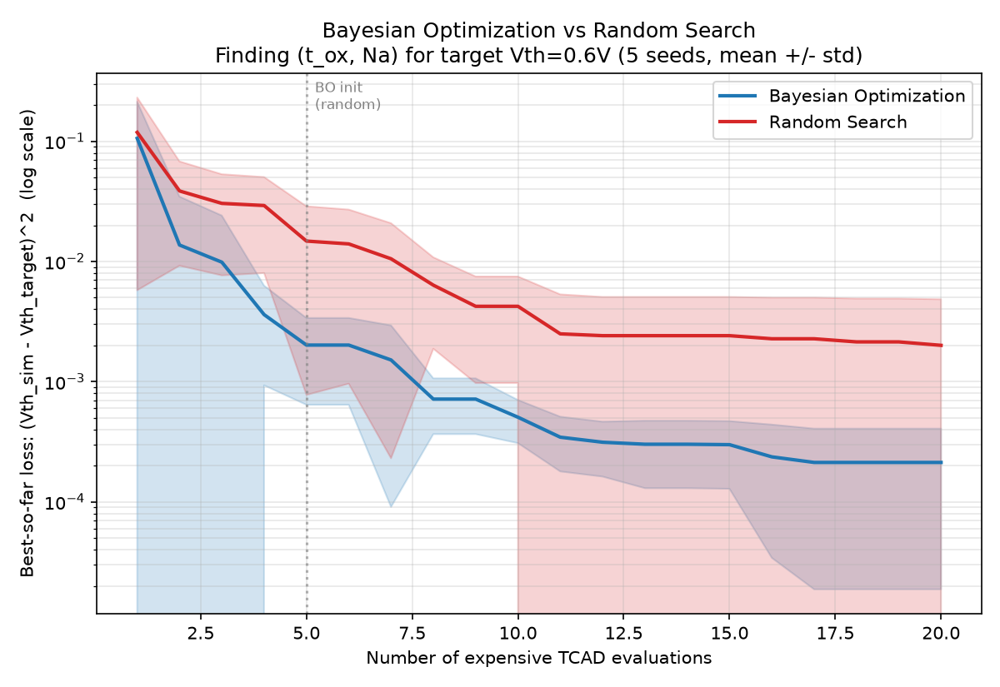

# Bayesian Optimization for TCAD Device Design

Physics-AI-Lab의 아홉 번째 프로젝트. 논문 리뷰 10번(Ferroelectric Compact Models에서 active learning으로 TCAD 호출 횟수를 최소화)에서 다룬 기법을, [프로젝트 03(TCAD Surrogate)](../03_tcad-surrogate)과 같은 MOS 커패시터 Poisson 솔버에 직접 적용했습니다. 목표: **"목표 문턱전압(Vth)을 만족하는 (산화막 두께, 도핑농도) 조합을, 최소한의 비용이 큰 TCAD 호출로 찾기."**

## 문제 설정

- **설계 변수**: 산화막 두께 t_ox (2~10nm), 채널 도핑농도 Na (log scale, 10¹⁷~10¹⁸ cm⁻³)
- **"비용이 큰" 시뮬레이터**: box-integration + Newton-Raphson Poisson 솔버로 Vg를 스윕해 quasi-static C-V 곡선을 얻고, 커패시턴스 최솟값(공핍→반전 전이) 위치를 Vth로 정의. 호출 1회에 ~150-250ms.
- **목표**: Vth = 0.6V를 만족하는 (t_ox, Na) 탐색, loss = (Vth_sim - 0.6)²

## Bayesian Optimization: 처음부터 직접 구현

scikit-learn 등에 의존하지 않고, **Gaussian Process 회귀(RBF 커널, closed-form posterior) + Expected Improvement 획득함수**를 직접 구현했습니다 (MLIP/MeshGraphNet 프로젝트에서 신경망을 직접 구현한 것과 같은 방식). GP+BO 알고리즘 자체는 TCAD와 무관한 간단한 2D 테스트 함수로 먼저 검증했습니다.

## 디버깅 노트: 두 가지 실제 문제

### 1. C-V 최솟값이 강반전 기준(2φ_F)에 도달하지 못함
초기에는 표면전위가 2φ_F(교과서 강반전 기준)에 도달하는 Vg를 Vth로 정의했으나, 높은 Vg에서 반전층 전하가 매우 커져 필요한 스크리닝 길이가 격자 간격보다 짧아지는 문제([프로젝트 08 capstone](../08_negf_poisson_capstone)에서도 마주친 것과 같은 종류의 grid resolution 이슈)로 표면전위가 물리적으로 saturate되어 목표에 도달하지 못했다. **C-V 곡선의 커패시턴스 최솟값**(공핍-반전 전이 근처, 강반전까지 갈 필요 없이 안정적으로 잘 잡히는 기준)으로 Vth 정의를 바꿔 해결했다.

### 2. 이산 격자값 그대로 반환 → 목표함수가 계단함수가 됨
C-V 최솟값의 위치를 Vg 스윕 격자점 그대로("`vg_array[min_idx]`") 반환하자, 목표함수가 20개 이산값만 갖는 계단함수가 되어버려 BO와 Random Search가 구분되지 않는 결과(두 방법이 항상 완전히 동일한 최종 loss)가 나왔다. 최솟값 주변 3점을 **포물선(parabolic) 보간**해 연속적인 Vth 추정치를 얻는 것으로 해결 — 이후 BO와 Random Search의 성능 차이가 명확하게 드러났다.

## 결과

5개 random seed에 걸친 평균 수렴 곡선 비교 (20회 평가 예산, BO는 5회 무작위 초기화 + 15회 EI 기반 탐색):

- **최종 loss (평가 20회 시점)**: Bayesian Optimization 0.000213 ± 0.000194, Random Search 0.002006 ± 0.002845
- **약 9.4배 낮은 최종 오차**, 그리고 BO 쪽의 표준편차가 훨씬 작아 — 어떤 seed에서도 안정적으로 좋은 해를 찾는 반면, Random Search는 seed에 따라 편차가 큼 (seed 2에서 0.0077까지 나쁘게 나온 경우도 있음)

## Status

| Step | Status |
|---|---|
| MOS 커패시터 TCAD 시뮬레이터 (C-V 기반 Vth 추출) | ✅ Done |
| Grid resolution 문제 진단 및 Vth 정의 수정 | ✅ Done |
| 이산 격자 계단함수 문제 진단 및 포물선 보간 수정 | ✅ Done |
| GP 회귀 + EI 획득함수 from-scratch 구현 및 검증 | ✅ Done |
| BO vs Random Search 비교 (5 seeds, 9.4배 개선 확인) | ✅ Done |
| 다차원(3개 이상 설계변수) 확장 | ⬜ Planned |
| 실제 I-V 곡선 형태 전체를 목표로 하는 다중 목표 최적화 | ⬜ Planned |

## Files
- `src/tcad_sim.py` — "비용이 큰" TCAD 시뮬레이터 (MOS 커패시터 Poisson 솔버, C-V 기반 Vth 추출)
- `src/gp_bo.py` — Gaussian Process 회귀 + Expected Improvement, from-scratch 구현
- `src/compare_bo_vs_random.py` — BO vs Random Search 비교 실험
- `src/evaluate.py` — 결과 시각화
