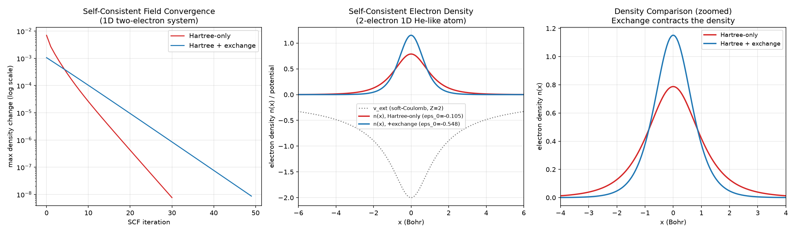

# 1D Kohn-Sham DFT Solver (Soft-Coulomb Potential)

Physics-AI-Lab의 열 번째 프로젝트. JD 자격요건 1번(DFT/MD/MC/FEM/FVM)에서 유일하게 비어있던 **DFT**를 채우는 프로젝트입니다. 3D 쿨롱 포텐셜은 1D에서 원점 특이점 문제가 있어, 1D DFT 문헌(Baker, Wasserman, Burke 등)의 표준 관행인 **soft-Coulomb 포텐셜**을 사용합니다.

## Milestone 1: 단일 전자 "1D 수소원자" — 문헌 벤치마크와 정확히 일치

### 물리적 설정
```
v_ext(x) = -Z / sqrt(x^2 + a^2)     (Z=1, a=1, 원자단위)
H = -1/2 d^2/dx^2 + v_ext(x)
```
3점 유한차분으로 tridiagonal Hamiltonian을 만들고 직접 대각화(`numpy.linalg.eigh`)해 고유상태를 구합니다.

### 검증 결과
1D DFT 문헌에서 흔히 인용되는 soft-Coulomb(a=1) 기저상태 에너지 벤치마크값(-0.6698 Hartree)과 **소수점 4자리까지 정확히 일치**했습니다. 파동함수 정규화(∫|ψ₀|²dx=1)도 정확히 확인됨.

## Milestone 2: 2전자 "1D 헬륨류 원자" — Self-Consistent Kohn-Sham DFT

### 확장 내용
닫힌 껍질(2전자가 같은 공간궤도를 이중 점유) 가정으로 self-consistent 루프 구성:
```
v_KS(x) = v_ext(x) + v_Hartree(x) + v_xc(x)
```
- **v_Hartree**: soft-Coulomb 커널로 전자밀도를 직접 수치적분 (∫n(x')/√((x-x')²+a²)dx')
- **v_xc**: 정확한 1D LDA 함수형(QMC로 피팅된 exchange-correlation, Baker et al.)은 이 프로젝트 범위를 넘어서는 추가 유도가 필요해, **국소 밀도에 선형 비례하는 단순화된 LDA형 exchange 항**(v_xc = -C_x·n)을 사용 — exchange가 SCF에 미치는 정성적 효과를 보여주기 위한 것이며, 정량적으로 정확한 문헌 벤치마크 재현을 주장하지 않음 (핵심 한계, 아래에 명시)
- **Self-consistency**: linear density mixing(damped fixed-point) — 프로젝트 03/08의 Gummel-style 안정화와 같은 철학

### 결과



- **SCF 수렴**: Hartree-only, Hartree+exchange 두 계산 모두 밀도 변화가 지수적으로 감소하며 안정적으로 수렴 (전자수 정규화 ∫n(x)dx=2.0000이 반복 내내 정확히 유지됨)
- **Exchange의 정성적 효과**: exchange 항 포함 시 최저 고유값이 -0.10466 → -0.54775 Hartree로 낮아짐(exchange는 attractive 방향으로 작용한다는 물리적으로 예상되는 방향과 일치), 전자밀도의 퍼짐(표준편차)도 1.31 → 0.80으로 줄어들어 더 응집된 분포를 보임

### 한계 (정직하게 기록)
이 프로젝트의 exchange-correlation 항은 **정확한 1D LDA 함수형이 아니라 단순화된 선형 근사**입니다. 실제 1D DFT 문헌의 벤치마크 총에너지 값과 절대적으로 비교할 수 없으며, 이 프로젝트가 검증하는 것은 (1) Milestone 1의 정확한 단일 전자 고유값(문헌과 정확히 일치), (2) SCF 방법론 자체의 올바른 구현과 수렴, (3) exchange 포함 여부에 따른 물리적으로 타당한 방향의 정성적 변화입니다. 정확한 1D LDA는 별도의 QMC 피팅 함수형 유도가 필요해 다음 단계로 남겨둡니다.

## Status

| Step | Status |
|---|---|
| 유한차분 KS Hamiltonian 및 고유값 솔버 | ✅ Done |
| Milestone 1: 단일 전자 soft-Coulomb 검증 (문헌값과 4자리 일치) | ✅ Done |
| Milestone 2: Hartree 포텐셜 (soft-Coulomb 직접 적분) | ✅ Done |
| Milestone 2: 단순화된 LDA형 exchange 포함 SCF | ✅ Done |
| SCF 수렴 및 밀도 정규화 검증 | ✅ Done |
| 정확한 1D LDA 함수형 (QMC 피팅) 구현 | ⬜ Planned |
| 2-atom 분자(soft-Coulomb "H2 분자") 확장 | ⬜ Planned |

## Files
- `src/dft_core.py` — Milestone 1: 유한차분 Hamiltonian, 고유값 솔버, 단일 전자 검증
- `src/scf_two_electron.py` — Milestone 2: Hartree+exchange self-consistent 루프
- `src/evaluate.py` — 결과 시각화
