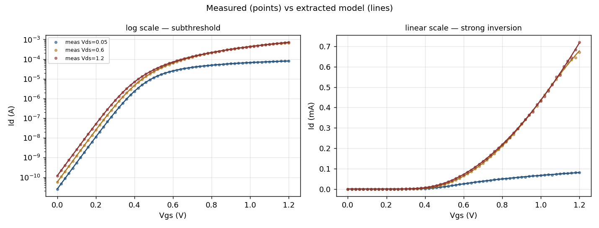
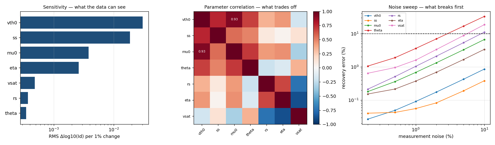

# Extraction report

Synthetic device, known ground truth, 1% relative measurement noise.

## 1. Recovery against ground truth

| parameter | truth | staged | error | simultaneous | error |
|---|---|---|---|---|---|
| `vth0` | 0.4 | 0.38449 | 3.9% | 0.39956 | 0.1% |
| `ss` | 0.075 | 0.074768 | 0.3% | 0.074934 | 0.1% |
| `mu0` | 0.03 | 0.02 | 33.3% | 0.029764 | 0.8% |
| `theta` | 0.35 | 0.2 | 42.9% | 0.34688 | 0.9% |
| `rs` | 180 | 400 | 122.2% | 177.98 | 1.1% |
| `eta` | 0.045 | 0.044319 | 1.5% | 0.044847 | 0.3% |
| `vsat` | 80000 | 50000 | 37.5% | 82941 | 3.7% |

Staged run escalated: **True** (15/15 across seeds)  
Simultaneous run escalated: **False** (0/15 across seeds)

## 2. Does the uncertainty analysis predict the real spread?

The Jacobian gives a predicted 1-sigma uncertainty per parameter without running any Monte Carlo. Comparing it against the measured spread over independent noise realisations is what makes the analysis usable rather than decorative.

| parameter | predicted 1σ | measured spread | sensitivity |
|---|---|---|---|
| `vth0` | 0.07% | 0.08% | 0.03023 |
| `ss` | 0.05% | 0.06% | 0.01860 |
| `mu0` | 0.58% | 0.65% | 0.00381 |
| `theta` | 3.57% | 3.45% | 0.00035 |
| `rs` | 1.65% | 1.74% | 0.00037 |
| `eta` | 0.47% | 0.52% | 0.00260 |
| `vsat` | 2.91% | 3.09% | 0.00048 |

Condition number of JᵀJ: **1.79e+05**

## 3. What trades off against what

| pair | correlation |
|---|---|
| `vth0` ↔ `mu0` | +0.925 |

## 4. Where each parameter stops being meaningful

Noise level at which mean recovery error first exceeds 10%.

| parameter | breaks at | error at 10% noise |
|---|---|---|
| `vth0` | — | 0.9% |
| `ss` | — | 0.4% |
| `mu0` | — | 6.6% |
| `theta` | 5.0% noise | 32.7% |
| `rs` | 10.0% noise | 11.0% |
| `eta` | — | 3.4% |
| `vsat` | 10.0% noise | 18.5% |

