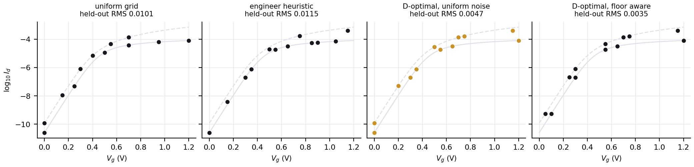
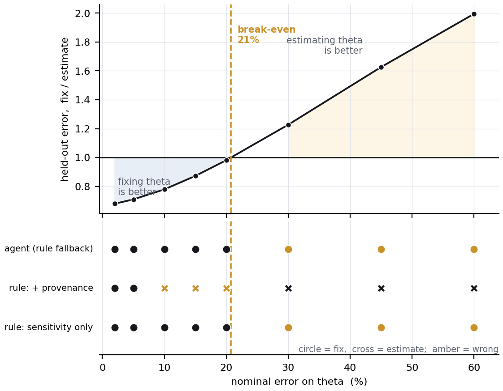

# Stage 1 - optimal measurement design

Synthetic device, known ground truth. 12 bias points, at most 3 distinct drain biases, stress and specification limits enforced.

## 1. Does choosing the points matter?

Held-out prediction error on a dense grid no design ever saw.

| design | held-out RMS log10(Id) | vs uniform |
|---|---|---|
| `uniform` | 0.01013 | 1.00x |
| `heuristic` | 0.01151 | 0.88x |
| `greedy_D_uniform_noise` | 0.00470 | 2.16x |
| `greedy_D` | 0.00349 | 2.91x |

`greedy_D_uniform_noise` is the textbook design: it assumes the measurement noise is the same everywhere. It is not -- in deep subthreshold the current approaches the instrument floor. The textbook design puts points where sensitivity is largest, which is exactly where precision is worst.

## 2. The decision that actually matters

`theta` carries about 1/87 of `vth0`'s sensitivity (project 12): no measurement plan recovers it. Fixing it removes a nuisance direction -- but only if the value it is fixed at is close enough.

| nominal error on theta | estimate it | fix it | ratio | better |
|---|---|---|---|---|
| 2% | 0.00349 | 0.00237 | 0.68 | fix |
| 5% | 0.00347 | 0.00246 | 0.71 | fix |
| 10% | 0.00347 | 0.00270 | 0.78 | fix |
| 15% | 0.00347 | 0.00302 | 0.87 | fix |
| 20% | 0.00347 | 0.00340 | 0.98 | fix |
| 30% | 0.00347 | 0.00426 | 1.23 | estimate |
| 45% | 0.00347 | 0.00564 | 1.63 | estimate |
| 60% | 0.00337 | 0.00672 | 2.00 | estimate |

The same decision is worth a 30% improvement or a 2x degradation depending on a quantity that is not in the data.

## 3. Who finds the boundary

| decision maker | fixes theta up to | wrong at | wrong / total |
|---|---|---|---|
| `rule_sensitivity_only` | 60% | 30%, 45%, 60% | 3 / 8 |
| `rule_with_provenance` | 5% | 10%, 15%, 20% | 3 / 8 |
| `agent` | 60% | 30%, 45%, 60% | 3 / 8 |

> The agent row above is the **rule fallback**: no LLM was reached in this run. Run `scripts/run_llm_arm.py` to fill it in. A fallback row is not evidence about an agent.

## 4. What this stage does not show

- A c-optimal design on `vth0` beat D-optimal on `vth0`'s uncertainty by 4.7% over 60 noise realisations. The sampling error of a standard deviation from 60 samples is about 9%, so this is reported as **not established**.
- Designs are built at the believed parameters, not the true ones. Sequential re-design would address the gap; it is not implemented here.

