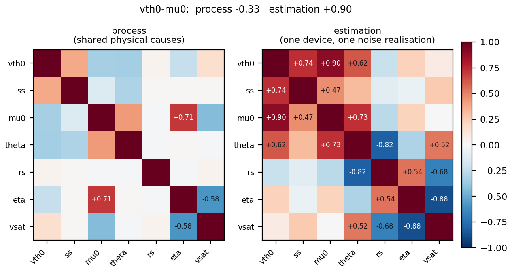
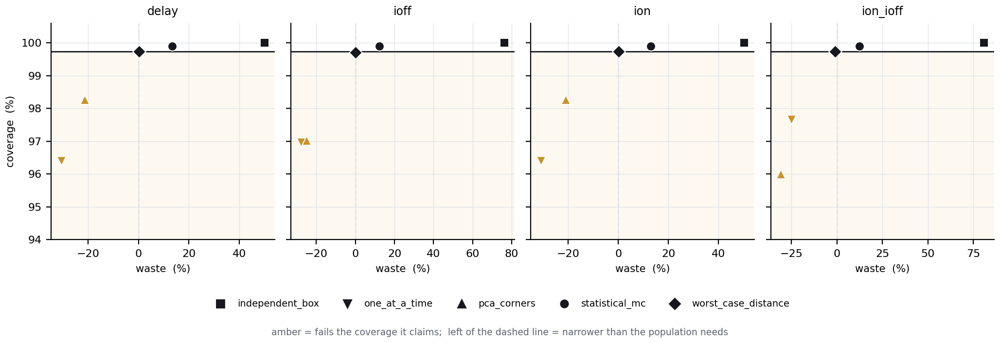

# Stage 2 - corner and statistical models

Synthetic population of 3000 devices, sampled from physical causes rather than from a parameter covariance. Corners at 3 sigma (nominal coverage 99.73%).

## 1. Process correlation is not estimation correlation

Both are correlation matrices over the same seven parameters, and they answer different questions. Process correlation says how devices differ from one another; estimation correlation says how the extraction trades parameters off against one noise realisation of a single device.

For `vth0` and `mu0` they have **opposite signs**: process -0.329, estimation +0.897. Stage 1 measured the estimation value and reported it as the pair that trades off; using that number to build a corner model would tilt every corner the wrong way.

12 of 21 parameter pairs differ in sign between the two matrices.

| parameter | dominant physical cause |
|---|---|
| `vth0` | vfb |
| `ss` | dit |
| `mu0` | L |
| `theta` | tox |
| `rs` | rc |
| `eta` | L |
| `vsat` | local |

### The parameters are not seven independent dimensions

6 shared physical causes drive 7 parameters, plus a small independent term per parameter for local effects. The result is full rank but strongly anisotropic: **3 axes carry 90% of the variance**, and the covariance condition number is 146.

That is the quantitative form of the objection to a box. A box treats all seven directions as equally wide; the process does not move that way, so most of the volume a box encloses is population that will never exist.

The local term is not decoration. Without it, two parameters driven by a single shared cause come out perfectly correlated -- an earlier version of this module produced an `eta`/`vsat` correlation of exactly -1.000, which no real population shows. Random dopant fluctuation and line-edge roughness act on each parameter separately and break that degeneracy.

## 2. The observed spread is not the process spread

200 devices measured through stage 1's 12-point design and extracted, then the extraction covariance predicted by stage 1's Fisher analysis subtracted.

| parameter | true sigma | observed | observed/true | deconvolved/true |
|---|---|---|---|---|
| `vth0` | 1.83% | 1.85% | 1.01x | 1.03x |
| `ss` | 1.29% | 1.32% | 1.02x | 1.07x |
| `mu0` | 4.08% | 4.47% | 1.09x | 0.99x |
| `theta` | 2.40% | 22.33% | 9.32x | 2.49x |
| `rs` | 8.93% | 11.81% | 1.32x | 0.92x |
| `eta` | 8.69% | 8.91% | 1.03x | 1.02x |
| `vsat` | 1.00% | 10.22% | 10.18x | 2.76x |

A ratio above 1 in the `observed/true` column is margin that belongs to the instrument rather than to the devices. Subtracting the extraction covariance is what stage 1's measurement design buys a corner model: the deconvolved sigma lands within 20% of the truth for 5 parameters (`vth0`, `ss`, `mu0`, `rs`, `eta`).

**It does not work for every parameter, and the ones it fails on are the ones stage 1 already identified.** `theta` is inflated 9.3x, `vsat` is inflated 10.2x. These are the parameters stage 1 found to be weakly identifiable or not identifiable at all -- `theta` carries about 1/87 of `vth0`'s sensitivity. Almost none of their observed spread is process variation; it is extraction noise. Subtracting a *linear* estimate of that noise does not recover the truth either, because the error is no longer small enough for the linearisation to hold.

The lesson is narrower than it first looks: a parameter's observed spread can be deconvolved only if the parameter was measurable to begin with. For one that is not, the observed spread carries no information about the process and no correction puts it back. A corner model should fix such a parameter at nominal rather than give it a range -- which is the same decision stage 1 was measuring, arrived at from the other direction.

## 3. Coverage against waste

Coverage is the fraction of real devices inside the predicted range; waste is how much wider that range is than the one the devices actually occupy. A corner set that covers everything at twice the necessary width is not a good corner set.

| metric | method | corners | coverage | waste | safe |
|---|---|---|---|---|---|
| delay | `independent_box` | 128 | 100.00% | +50% | yes |
| delay | `one_at_a_time` | 14 | 96.40% | -31% | **no** |
| delay | `pca_corners` | 14 | 98.27% | -21% | **no** |
| delay | `statistical_mc` | 2000 | 99.90% | +13% | yes |
| delay | `worst_case_distance` | 2 | 99.73% | +0% | yes |
| ioff | `independent_box` | 128 | 100.00% | +76% | yes |
| ioff | `one_at_a_time` | 14 | 96.97% | -28% | **no** |
| ioff | `pca_corners` | 14 | 97.03% | -25% | **no** |
| ioff | `statistical_mc` | 2000 | 99.90% | +12% | yes |
| ioff | `worst_case_distance` | 2 | 99.70% | +0% | yes |
| ion | `independent_box` | 128 | 100.00% | +50% | yes |
| ion | `one_at_a_time` | 14 | 96.40% | -31% | **no** |
| ion | `pca_corners` | 14 | 98.27% | -21% | **no** |
| ion | `statistical_mc` | 2000 | 99.90% | +13% | yes |
| ion | `worst_case_distance` | 2 | 99.73% | +0% | yes |
| ion_ioff | `independent_box` | 128 | 100.00% | +81% | yes |
| ion_ioff | `one_at_a_time` | 14 | 97.67% | -25% | **no** |
| ion_ioff | `pca_corners` | 14 | 96.00% | -31% | **no** |
| ion_ioff | `statistical_mc` | 2000 | 99.90% | +12% | yes |
| ion_ioff | `worst_case_distance` | 2 | 99.73% | -1% | yes |

### Narrowest corner set that still covers what it claims

`statistical_mc` is excluded: it is drawn from the same distribution the reference range comes from, so it reproduces that range by construction and would always appear to win, at the cost of hundreds of simulations.

| metric | method | corners | waste |
|---|---|---|---|
| ion | `worst_case_distance` | 2 | +0% |
| ioff | `worst_case_distance` | 2 | +0% |
| delay | `worst_case_distance` | 2 | +0% |
| ion_ioff | `worst_case_distance` | 2 | -1% |

The box corners cover everything, at +50% to +81% waste across 128 simulations. Targeting the k-sigma ellipsoid instead covers the same population within +0% waste using 2.

## 4. What this stage does not show

- The metrics are **proxies** computed from the compact model, not a circuit solve. Stage 3 replaces them and re-checks whether these corners still bound the real thing.
- `worst_case_distance` needs the metric in advance, so it answers a narrower question than the others. It is not a general corner set and is reported only against the metric it was built for.
- `statistical_mc` is a sample, not a corner set: its range is bounded by what it happened to draw, so its coverage improves with sample count rather than being a property of the method.
- Everything is synthetic, with known ground truth. The sensitivity coefficients in `physical.py` are first-order textbook relations, not values fitted to silicon.

