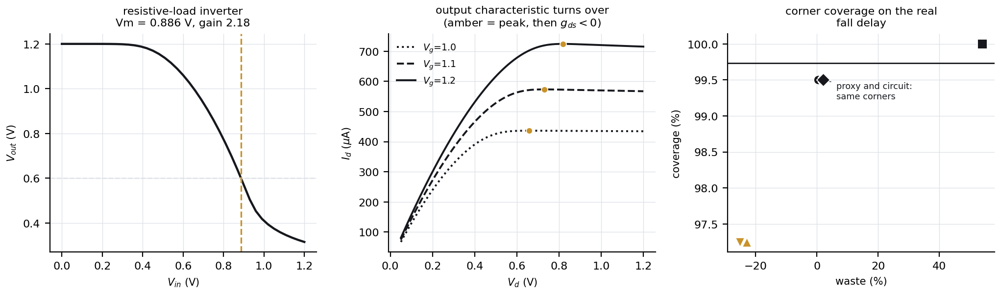

# Stage 3 - circuit-level validation

A hand-written MNA solver with damped Newton, NMOS-with-load circuits, and stage 2's corner sets re-scored against real measurements.

## 1. The device evaluation had to be fixed first

Project 12 solves series resistance by damped fixed-point iteration capped at 40 steps and returns the 40th value either way.

| | iterations | result |
|---|---|---|
| nominal, fixed point | 38 | under the 40-step cap, by 2 |
| nominal, Newton | 4 | converged |
| `rs=2000`, fixed point | 500+ | **unconverged**, current off by 72.2% |
| `rs=2000`, Newton | 7 | converged |

Where project 12's loop did converge the two agree to 3.1e-14 relative, so the physics is unchanged. Derivatives are now analytic, through the implicit function theorem, and match finite differences of the converged solve to 6.5e-09.

Stage 2 was re-checked and stayed under the cap, so its results stand.

## 2. The model has negative output conductance

`gds < 0` over **12%** of the operating grid, from about `Vg = 0.95 V`, `Vd = 0.70 V`. The drain current peaks and then falls:

| gate bias | peak | at | falls by |
|---|---|---|---|
| Vg = 1.0 V | 436.4 uA | Vd = 0.66 V | 0.43% |
| Vg = 1.1 V | 573.5 uA | Vd = 0.73 V | 1.06% |
| Vg = 1.2 V | 724.5 uA | Vd = 0.82 V | 1.24% |

This is in project 12's own current, not an artefact of the new derivative, and it survives setting `rs = 0`, so it is the intrinsic model: the velocity-saturation term outruns DIBL.

Series resistance partly hides it. The terminal derivative is `f_d / (1 + f_d*rs)`, so a negative `f_d` makes the denominator smaller than one and a larger `rs` shrinks the region that looks turned over:

| `rs` | negative `gds` |
|---|---|
| 0 (intrinsic) | 14.5% |
| 180 (nominal) | 12.0% |
| 500 | 7.5% |

So the percentage above belongs to a particular `rs`, not to the model, and the circuit runs at nominal -- where the region is smaller than the model's own. That is a second reason no solve broke on it, independent of the load-line argument below.

### It did not break any solve, and the reason is worth stating

The design document predicted this would break Newton. **It did not.** Two conditions have to hold at once and they exclude each other inside a 1.2 V rail:

- For `gds` to dominate the node conductance the load must exceed **25.7 kOhm**.
- With a load that large the device pulls the output down to a few tens of millivolts, far below the `Vd` where `gds` turns negative.

| load | operating point | gds | 1/R + gds |
|---|---|---|---|
| 2.0 kOhm | 0.330 | +1.0e-03 | +1.5e-03 |
| 10.0 kOhm | 0.073 | +1.5e-03 | +1.6e-03 |
| 25.7 kOhm | 0.029 | +1.5e-03 | +1.6e-03 |
| 50.0 kOhm | none | - | - |

A weak-load inverter does bias into the region, and still converges: the load conductance is around fifty times `gds`. The turnover is also shallow, about 1% deep, so no load line inside the rail crosses it twice. The defect is real and did not bite here. A current-mirror load or a cascode is where it would, and neither exists in an NMOS-only model.

## 3. Do stage 2's corners bound the circuit?

400 devices, measured through the inverter rather than through a proxy.

| metric | method | corners | coverage | waste | safe |
|---|---|---|---|---|---|
| gain | `independent_box` | 128 | 100.00% | +107% | yes |
| gain | `one_at_a_time` | 14 | 100.00% | +27% | yes |
| gain | `pca_corners` | 14 | 96.25% | -25% | **no** |
| gain | `statistical_mc` | 400 | 99.75% | +7% | yes |
| gain | `wcd_circuit_delay` | 2 | 99.75% | +1% | yes |
| gain | `wcd_proxy_delay` | 2 | 99.25% | -3% | yes |
| t_fall | `independent_box` | 128 | 100.00% | +54% | yes |
| t_fall | `one_at_a_time` | 14 | 97.25% | -25% | **no** |
| t_fall | `pca_corners` | 14 | 97.25% | -23% | **no** |
| t_fall | `statistical_mc` | 400 | 99.50% | +1% | yes |
| t_fall | `wcd_circuit_delay` | 2 | 99.50% | +2% | yes |
| t_fall | `wcd_proxy_delay` | 2 | 99.50% | +2% | yes |
| v_low | `independent_box` | 128 | 100.00% | +71% | yes |
| v_low | `one_at_a_time` | 14 | 98.50% | -12% | **no** |
| v_low | `pca_corners` | 14 | 96.25% | -27% | **no** |
| v_low | `statistical_mc` | 400 | 100.00% | +7% | yes |
| v_low | `wcd_circuit_delay` | 2 | 99.00% | -2% | **no** |
| v_low | `wcd_proxy_delay` | 2 | 99.00% | -5% | **no** |
| vth_switch | `independent_box` | 128 | 100.00% | +43% | yes |
| vth_switch | `one_at_a_time` | 14 | 92.50% | -41% | **no** |
| vth_switch | `pca_corners` | 14 | 96.75% | -31% | **no** |
| vth_switch | `statistical_mc` | 400 | 99.50% | -1% | yes |
| vth_switch | `wcd_circuit_delay` | 2 | 99.00% | -3% | **no** |
| vth_switch | `wcd_proxy_delay` | 2 | 99.00% | -3% | **no** |

### The registered prediction

Before measuring, stage 3's design recorded this: a corner set built against stage 2's proxy (`C*V/Ion`) should **under-cover** the real fall delay, because the real delay depends on the whole trajectory the output swings through and not on drive current at one bias.

| built against | coverage on real delay | waste | safe |
|---|---|---|---|
| the proxy | 99.50% | +2% | yes |
| the circuit | 99.50% | +2% | yes |

**The prediction did not hold.** The proxy-built corner set covered the real delay as well as the circuit-built one, at the same waste. Recorded as a miss.

### Why it missed

The reasoning behind the prediction was that the real delay depends on the trajectory the output swings through, not on drive current at one bias. That is true. What was wrong was the magnitude: across a realistic population the devices differ almost entirely by a current *scale*, and the delay integral scales inversely with that same scale, so the proxy is the real delay multiplied by a near-constant.

Separating the two kinds of variation shows the reasoning was right and only the size was wrong -- scale variation leaves the proxy intact, shape variation breaks it:

| population | spread | correlation with real delay | ratio spread |
|---|---|---|---|
| baseline | 0.6% | 0.99756 | 1.33% |
| mu0 x5 (scale) | 4.0% | 0.99755 | 1.80% |
| vth0 x5 (shape) | 3.0% | 0.99774 | 1.42% |
| vth0 x15 (shape) | 9.0% | 0.99774 | 2.43% |
| vth0 x30 (shape) | 18.0% | 0.97355 | 7.41% |

The proxy only starts to fail once the threshold voltage spreads by something like 18%, an order of magnitude beyond the 1.8% this process actually has. For this circuit and this process it was a good proxy, and stage 2's corner choice was not put at risk by it.

## 4. What this stage does not show

- A hand-written Newton is not SPICE. Source stepping, gmin stepping and limiting schemes would change which of these solves struggle.
- NMOS-with-load circuits only, because the model is NMOS only. No CMOS inverter, no current-mirror load, no cascode -- which is exactly where the negative conductance would have mattered.
- The population fall delay is computed by quadrature on the single-node circuit equation rather than by stepping Newton. It was checked against the solver's transient and agreed to 0.16% on 4 devices.
- Everything is synthetic, with known ground truth.

