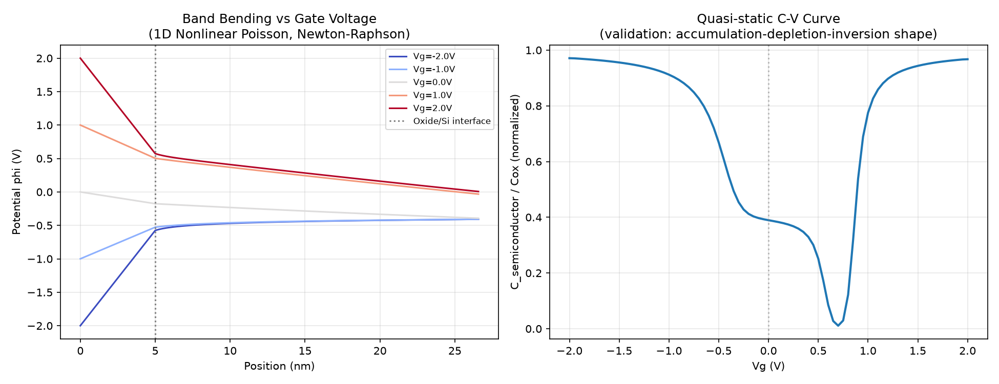
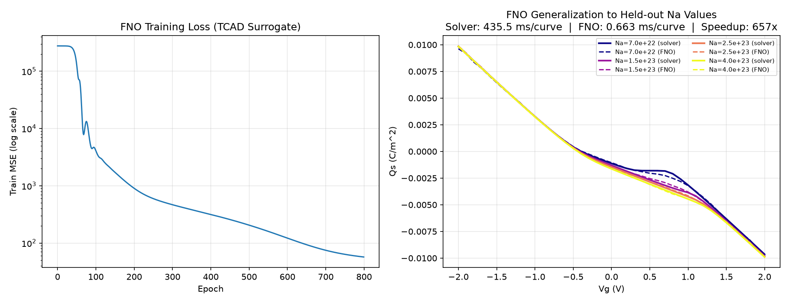

# TCAD Surrogate: Self-built 1D Device Simulator (Sentaurus Substitute)

[← Back to Physics-AI-Lab](../../README.md)

Sentaurus TCAD 라이선스에 현재 접근할 수 없는 상황에서, **직접 1D Poisson-Drift-Diffusion 소자 시뮬레이터를 구현**해 TCAD-equivalent 데이터를 스스로 생성하고, 이를 기반으로 AI 서로게이트 모델을 학습하는 프로젝트입니다.

## Motivation

[SK하이닉스 TCAD Intelligence 팀의 사례](../../paper-reviews/sk-hynix-tcad-intelligence.md)와 [Fe-VNAND PINO 논문](../../paper-reviews/pino-fe-vnand-retention.md)이 공통적으로 다루는 문제 — "느린 TCAD 시뮬레이션을 AI로 가속화"하려면 먼저 **TCAD 자체가 무엇을 계산하는지**를 밑바닥부터 이해해야 한다고 판단했습니다. 상용 툴 없이 동일한 물리 방정식을 직접 풀어보는 것이 가장 확실한 방법입니다.

## Milestone 1: 1D Nonlinear Poisson Solver (MOS Capacitor) — ✅ Done

### 문제 정의
p-type MOS 커패시터(SiO2/Si)에서, 게이트 전압에 따른 반도체 표면의 band bending을 평형 상태(Boltzmann 통계) 비선형 Poisson 방정식으로 계산:

```
d/dx( eps(x) dphi/dx ) = -q * [p(phi) - n(phi) - Na(x)]
n(phi) = ni * exp(phi / Vt),   p(phi) = ni * exp(-phi / Vt)
```

경계조건: 게이트(x=0)에 Dirichlet Vg, bulk contact(x=L)에 평형 bulk potential.

### 이산화 방법: Box-Integration (FVM) ≡ 1D Linear FEM
각 노드 주변에 제어체적(control volume)을 잡고 flux balance를 세우는 **box-integration** 방식을 사용했습니다. 이는 Sentaurus를 포함한 대부분의 상용 TCAD 툴이 실제로 채택하는 이산화 기법이며, 1D 균일 계수 문제에서는 표준 선형 FEM(Galerkin)과 수학적으로 동일한 강성행렬(stiffness matrix)을 만듭니다 — 즉 FEM과 FVM 두 관점을 모두 실제로 구현하고 그 등가성까지 확인한 셈입니다.

비균일 메시(계면 근처는 Debye length 스케일로 촘촘하게, 벌크로 갈수록 기하급수적으로 성기게)를 사용해 급격한 band bending을 정확히 포착합니다.

### 비선형 해법: Newton-Raphson
전하밀도 항이 전위에 대해 지수함수(exponential)이므로 강한 비선형 시스템입니다. 매 반복마다 Jacobian을 직접 조립하고, damped Newton step으로 안정적으로 수렴시켰습니다 (~15-20회 반복 내 수렴).

### 검증 결과: Quasi-static C-V Curve



**왼쪽**: 여러 Vg에서의 전위 프로파일 — 음의 Vg에서 표면이 강하게 음전위로 휘는 축적(accumulation), 양의 Vg에서 공핍/반전으로 이어지는 전형적인 band bending 형태를 보임.

**오른쪽**: Vg를 스윕하며 계산한 quasi-static C-V 곡선 — **축적(고용량) → 공핍(용량 감소) → 반전(용량 회복)**이라는 교과서적 형태가 정확히 재현됨. 최솟값 위치가 이론적 문턱전압(2φ_F ≈ 0.81V) 근처에 오는 것도 물리적으로 타당함. 이 곡선 형태 자체가 솔버 정확성의 핵심 검증 지표.

## Milestone 3: AI Surrogate Trained on Self-generated Data — ✅ Done

### 목표
Milestone 1의 Poisson 솔버는 정확하지만 Newton-Raphson 반복이 필요해 느리다 (곡선 하나당 ~435ms, 41개 Vg 포인트 기준). [Neural Operator 프로젝트](../neural-operator)와 동일한 패턴으로, **여러 도핑 농도(Na)에 대해 Qs(Vg) 커브 전체를 한 번에 예측하는 FNO Operator**를 학습해 솔버를 대체할 수 있는지 검증했다.

### 데이터 생성
- 자체 Poisson 솔버로 Na ∈ [5×10²², 5×10²³] m⁻³ (실제 채널 도핑 범위에 해당) 구간에서 학습용 15개, 검증용(held-out) 4개 Qs(Vg) 커브를 직접 생성
- 입력: Na 값을 Vg grid 전체에 constant field로 broadcast (Neural Operator 프로젝트와 동일한 인코딩 방식)
- 출력: 해당 Na에서의 전체 Qs(Vg) 커브

### 결과



- **속도: 솔버 435.5 ms/curve → FNO 0.663 ms/curve, 약 657배 가속** (CPU 기준, GPU 사용 시 추가 향상 가능)
- 학습에 없던 Na 값에서도 전체적인 곡선 형태와 경향은 정확히 재현
- **한계 (정직하게 기록)**: 공핍-반전 전환 구간(Vg ≈ 0~1V, Na 의존성이 가장 급격하게 변하는 영역)에서 예측과 실제 사이에 눈에 띄는 오차가 있음. 학습 곡선이 15개로 적어 이 구간의 비선형성을 촘촘히 학습하지 못한 것으로 추정 — 학습 데이터를 늘리거나 이 구간에 collocation을 집중시키면 개선될 여지가 있음. GCA-PINN 프로젝트에서 발견한 "물리 제약/데이터가 가장 어려운 영역에서 서로게이트의 한계가 드러난다"는 패턴과 일치.


## Status

| Step | Status |
|---|---|
| 1D nonlinear Poisson solver (box-integration + Newton-Raphson) | ✅ Done |
| C-V curve validation (accumulation-depletion-inversion) | ✅ Done |
| AI surrogate (FNO) trained on self-generated data — 657x speedup | ✅ Done |
| Improve accuracy in depletion-inversion transition region | ⬜ Planned |
| Drift-Diffusion coupling (Scharfetter-Gummel) for full I-V | ⬜ Planned |

## Files
- `src/poisson_1d.py` — 솔버 본체 (mesh 생성, box-integration 이산화, Newton-Raphson)
- `src/sweep_cv.py` — Vg 스윕 및 C-V 곡선 검증
- `src/generate_operator_data.py` — 여러 Na에 대한 Qs(Vg) 커브 데이터 생성
- `src/train_fno_surrogate.py` — PhysicsNeMo FNO 서로게이트 학습 + 속도 비교
- `src/evaluate_surrogate.py` — 결과 시각화
